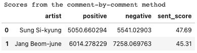

# [Sentiment Analysis] Sung Si-kyung vs. Jang Beom-june

(Korean title: [Sentiment Analysis] 감성분석을 활용하여 알아보는 성시경 vs.장범준 논란의 '주관적인' 승자는?)

* There was a heated debated on a Korean website about 'Which one of Sung Si-kyung or Jang Beom-june is a greater artist than the other?'. Below are ones of their most hit songs.
    * Sung Si-kyung: "On the road" https://youtu.be/v_K4tnMYsn4?t=54
    * Jang Beom-june: "Cherry blossom ending" https://www.youtube.com/watch?v=tbJX9f2MYPs
* Obviously, there is no way to objectively decide who is better because it's really a matter of personal musical preference.
    * Personally, I'm a fan of Sung :)
* In this notebook, we try to determine which one of the two artists the users of the website prefer 'subjectively' using the sentiment analysis.
   * **This analysis is for fun only!** 
   * The result of this analysis should not be used as an evidence for decisively choosing the winner.
* This notebook proceeds as follows:
    * Data preprocessing
    * Sentiment analysis (by **Naver's CLOVA Sentiment API**)
        * https://www.ncloud.com/product/aiService/clovaSentiment

    * **Result: Sung Si-kyung was favoured over Jang Beom-june on this particular website.** 

        * 

          where sent_score = positive / (positive + negative)
        
    * Word clouds
        *   

### **Again, this analysis is purely for entertainment purposes only!** 

* They are both great artists loved by a lot of Korean people.
    
I hope you enjoy this notebook!
