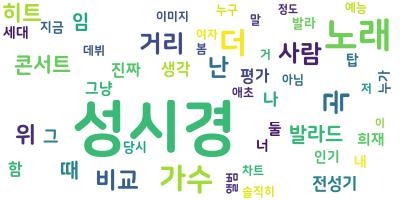
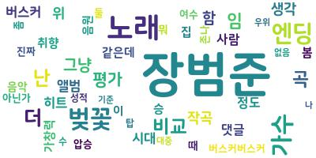

# [Sentiment Analysis] Sung Si-kyung vs. Jang Beom-june

(Korean title: [Sentiment Analysis] 감성분석을 활용하여 알아보는 성시경 vs.장범준 논란의 '주관적인' 승자는?)

* In a fervent online debate on a South Korean website, the question of "Who is the greater artist between Sung Si-kyung and Jang Beom-june?" sparked intense discussions. Provided below are links to some of their most popular songs:
    * Sung Si-kyung: "On the road" https://youtu.be/v_K4tnMYsn4?t=54
    * Jang Beom-june: "Cherry blossom ending" https://www.youtube.com/watch?v=tbJX9f2MYPs
* It is evident that there is no objective means to determine superiority, as it ultimately hinges on individual musical preferences. For the record, I personally favor Sung Si-kyung.
* In this notebook, we embark on a light-hearted endeavor to determine the subjective preference of the website users between these two artists using sentiment analysis. 
* This notebook proceeds as follows:
    * Data preprocessing
    * Sentiment analysis (by **Naver's CLOVA Sentiment API**)
        * https://www.ncloud.com/product/aiService/clovaSentiment

    * **Result: Sung Si-kyung was favoured over Jang Beom-june on this particular website.** 

        * 

          where sent_score = positive / (positive + negative)
        
    * Word clouds
        *   

### **Again, this analysis is purely for entertainment purposes only!** 
* The results should not be used as conclusive evidence for declaring a definitive winner. 
* Both Sung Si-kyung and Jang Beom-june are highly regarded artists who enjoy substantial popularity among Koreans.
    
I hope you enjoy this notebook!
